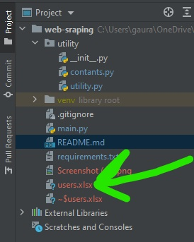

# Automate User Authentication using pyppetter


### Prerequisite:

    * Python 3.0+
    * pyppetter
   
       
1. Project setup

     * Pull from git repository 
     * Create virtual environment and apply to project
     * Run command for project dependency:
        ```
        $ pip install -r requirements.txt
        ```
     * Set your login credentials in constant.py
        ```
        $ username = '<username>
        $ password = '<password>
        ```

2. Run project
     ```
        $ python main.py
    ```
3. xls file added in our root project folder
   
    
   
4. xls file
    
    .png)


